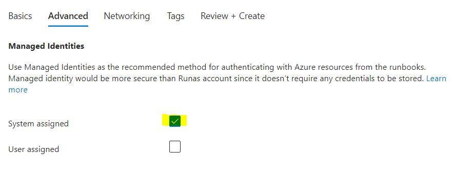

# Azure Power Automate 

### ==> Disclaimer work in progress. <==

## Voorwoord

Veel IT-ers houden zich nog altijd bezig met het simpele werk als het deployen van een Virtual machine via de portal, of soms zelfs al wel via Devops pipelines. Om daarna steeds op elke machine in te loggen, en alle extra taken uit te voeren.
Wat je het liefst zou willen is dat je op 1 locatie een VM kan bouwen als ook de inrichting op de machine uitvoeren.
Hiervoor kunnen we PowerAutomate gebruiken, we kunnen hierbij een VM bouwen en daarna kunnen er runbooks gestart worden om een complete VM op te leveren. Hieronder gaan we in op welke stappen je moet uitvoeren om dit werkende te krijgen.

## Creëren van een Automation Account

Het configureren van een Automation account is relatief eenvoudig.
Ga naar **Create a Resource**:

Zoek daar op **Automation** en klik daarna op **Create**:

Je komt nu in de basic tab en hier vullen we nu het volgende in:
Vul in: 
~~~
Resource Group = "de Resource Group waar het Automation account moet komen"
Automation Account name = "de naam die je aan het automation account te willen geven"
Region = "kies een regio"
~~~

In het tabblad advanced hoeven we niks aan te passen aangezien we gebruik gaan maken van een System Managed Identity

In het tabblad Networking gaan we nu geen aanpassing makenn, echter mijn advies zou zijn om in een PROD omgeving gebruik te maken van Private Access (dit om te voorkomen dat je Security issues gaat krijgen)

Klik daarna op **Review + Create** en daarna op **Create**

Nu word het Automation Account gecreërd en kunnen we door naar het maken van een Runbook.

~~~
**Deployen via Azure Powershell**

New-AzAutomationAccount -Name "AutomationAccount" -Location "West Europe" -ResourceGroupName "ResourceGroup01
~~~

## Creëren van een Runbook voor het Deployen van een Azure Pipeline .

Klik op de Go to Resource en dan kom je uit in het automation account.

Ga nu naar Runbooks en klik op **Create a Runbook**

Vul in: 
~~~
Name = "Geef het Runbook een logische naam"
Runbook type = "POwershell"
Runtime version = "5.1"
~~~

## Azure Site Recovery via Powershell

Mocht je nu veel machines hebben die toegevoegd moeten worden dan zou het makkelijk kunnen zijn om dit via Powershell uit te voeren.
Hieronder een link van Microsoft learn waarbij je via Powershell ASR kunt enable en replicaties kunt starten.

~~~
https://learn.microsoft.com/en-us/azure/site-recovery/azure-to-azure-powershell
~~~
