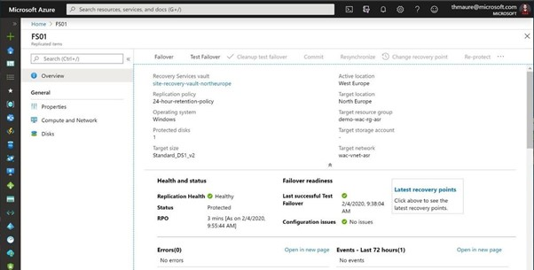

# Azure Power Automate 

### ==> Disclaimer work in progress. <==

## Voorwoord

Veel IT-ers houden zich nog altijd bezig met het simpele werk als het deployen van een Virtual machine via de portal, of soms zelfs al wel via Devops pipelines. Om daarna steeds op elke machine in te loggen, en alle extra taken uit te voeren.
Wat je het liefst zou willen is dat je op 1 locatie een VM kan bouwen als ook de inrichting op de machine uitvoeren.
Hiervoor kunnen we PowerAutomate gebruiken, we kunnen hierbij een VM bouwen en daarna kunnen er runbooks gestart worden om een complete VM op te leveren. Hieronder gaan we in op welke stappen je moet uitvoeren om dit werkende te krijgen.

## Creeren van een Automation Account

Het configureren van een Automation account is relatief eenvoudig.
Ga naar **Create a Resource**:

Zoek daar op **Automation** en klik daarna op **Create**:

Je komt nu in de basic tab en hier vullen we nu het volgende in:
Vul in: 
~~~
Resource Group = "de Resource Group waar het Automation account moet komen"
Automation Account name = "de naam die je aan het automation account te willen geven"
Region = "kies een regio"
~~~

In het tabblad advanced hoeven we niks aan te passen aangezien we gebruik gaan maken van een System Managed Identity

In het tabblad Networking gaan we nu geen aanpassing makenn, echter mijn advies zou zijn om in een PROD omgeving gebruik te maken van Private Access (dit om te voorkomen dat je Security issues gaat krijgen)

Klik daarna op **Review + Create** en daarna op **Create**

## Failover Azure VM naar een andere regio.

Nadat we de Disaster recovery hebben ingesteld en de replicatie heeft gelopen kunnen we nu wat grafische bronnen bekijken die duidelijk aangeven wat er gebeurt en hoe de resources met elkaar verbonden zijn.

Je kunt een failover uitvoeren waarmee je een productie failover uitvoert van de vm. Als de regio waar de source op staat nog beschikbaar is kun je ASR de machine laten stoppen en de laatste wijzigingen laten syncen, zodoende hebben we geen gegevens verlies.
Dit is uiteraard alleen mogelijk als de source regio nog bestaat. Anders neemt ASR de laatst bestaande restore point.

Voorbereid zijn op disaster recovery is uitstekend. We willen er echter zeker van zijn dat het werkt als je het nodig hebt. Je wilt niet wachten tot een echte ramp toeslaat om erachter te komen of alles correct is ingesteld. Dit is waar Testfailover voor is. Testfailover is een mogelijkheid voor ons om failover van de virtuele machine naar een geïsoleerd virtueel netwerk in de doelregio te maken om de virtuele machine en toepassing te kunnen testen zonder enige impact op de productie-implementatie.‎

‎Als je meerdere vm's hebt die je in een specifieke volgorde wilt failoveren en misschien zelfs enkele extra scripts wilt laten uitvoeren om volledig failover uit een regio uit te voeren, biedt ASR ons ook [Recoveryplans](https://docs.microsoft.com/en-us/azure/site-recovery/recovery-plan-overview?WT.mc_id=itopstalk-blog-thmaure). Recoveryplans zijn idealer voor complexere scenario's dan slechts één virtuele machine.‎

## Azure Site Recovery via Powershell

Mocht je nu veel machines hebben die toegevoegd moeten worden dan zou het makkelijk kunnen zijn om dit via Powershell uit te voeren.
Hieronder een link van Microsoft learn waarbij je via Powershell ASR kunt enable en replicaties kunt starten.

~~~
https://learn.microsoft.com/en-us/azure/site-recovery/azure-to-azure-powershell
~~~
