# Configure Azure ARC in een test omgeving

### ==> Disclaimer work in progress. <==

## Voorwoord

Soms is het handig om even snel een test omgeving op te zetten, Zodat je dingen kunt testen. Echter is het niet altijd mogelijk om een hele Hyper-V omgeving op te tuigen.
Hoe ga je dat snel doen? Wat heb je daar voor nodig? en kan dit in Azure? Meerdere vragen die ik nog wel eens gesteld krijg.
Dus in deze blog ga ik jullie uitleggen hoe je in Azure een Hyper-V omgeving kunt bouwen, en hoe je daarna Azure ARC erop installeert zodat je de machines kunt beheren via de Azure Portal.

## Bouw een nieuwe Server die geschikt is voor Hyper-V (Portal)

We gaan nu via de portal een nieuwe machine bouwen die voldoet aan de eisen om Hyper-V te mogen installeren.(heel veel machines in Azure hebben namelijk niet de juiste specs om een Hyper-V omgeving te kunnen optuigen.)

Ga naar http://portal.azure.com en log in met de credentials om een machine te kunnen bouwen.

Ga naar **Create a Resources.**

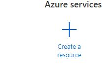

Zoek daarna op **Windows Server**, en klik daarna op **Create**

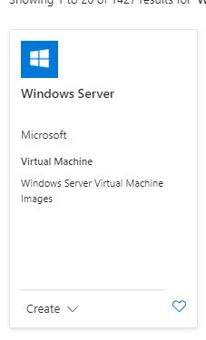

Kies daarna voor **Windows Server 2019 Datacenter** en druk op **Create**

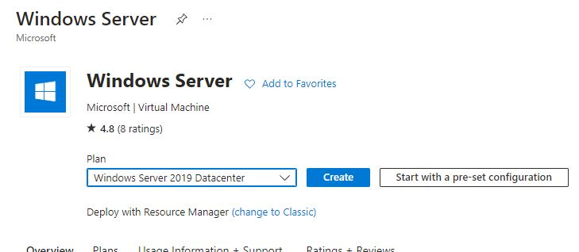

-----
Vervolgens moet je de onderstaande gegevens invullen..

~~~
Subscription = "de subscription die je gebruikt om machines te installeren"
Resource Group = Selecteer een bestaande Resource group of maak een nieuwe aan.
Virtual Machine name = HV01
Region = Kies de regio die het dichtst bij je zit. in ons geval is dat West-Europe
Availablility Options = No Infrastructure redundancy required ( Kies niet hiervoor als je een live omgeving ervan gaat maken)
Security Type = Trusted launch virtual machines
Image = Windows Server 2019 Datacenter - x64 Gen1 (Let op dit Moet **GEN1** zijn anders werkt het niet)
Size = Dit moet een V3 verie zijn om Hyper-V te kunnen installeren. Dus de Stansdard_D8s_v3

Username = Zelf in te vullen
Password = Zelf in te vullen

de rest mag default blijven
~~~
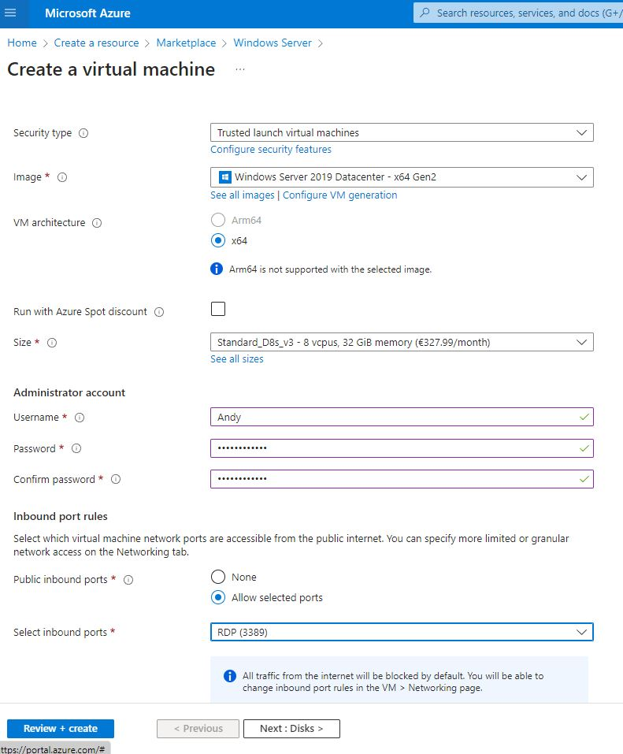

En klik op **Review & Create** 

Na de Review kun je op **Create** klikken

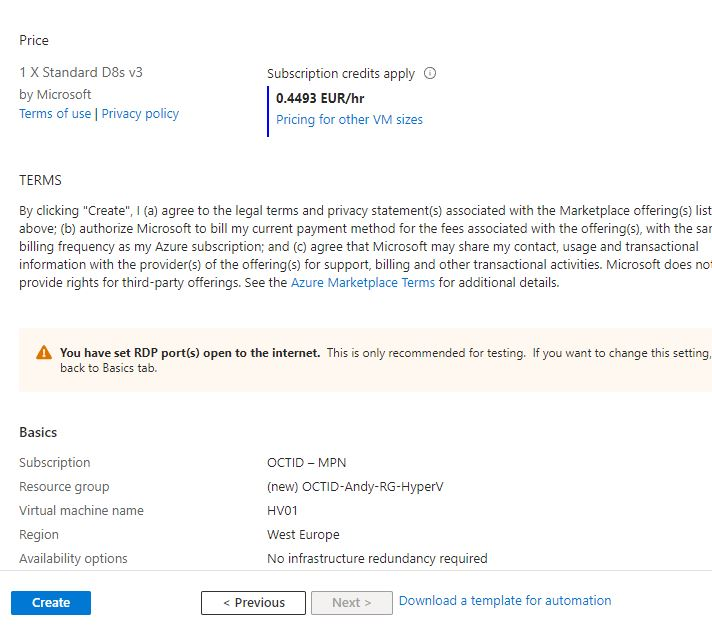

Na een tijdje is de machine klaar en gaan we connecten en inloggen op de machine.

Ga naar de resource die we net hebben aangemaakt en klik op **Connect**.

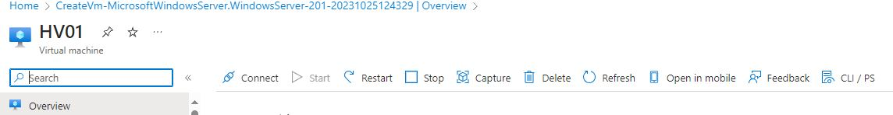

Mocht je een andere manier dan Native RDP hebben geconfigureerd connect via die manier anders klik op **select** bij Native RDP en er word een rdp file gedownload.

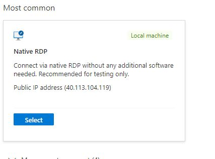

Open de RDP file en login op de nieuwe Server met de Admin credentials die je toen straks hebt opgegeven.

## Bouw een nieuwe Server die geschikt is voor Hyper-V (Powershell)

~~~~
# Variables
$resourceGroupName = "YourResourceGroupName"
$vmName = "YourVMName"
$location = "East US" # Change this to the desired Azure region
$adminUsername = "YourAdminUsername"
$adminPassword = "YourAdminPassword"
$vmSize = "Standard_D8s_v3" (nodig voor een Gen1 machine)
$imagePublisher = "MicrosoftWindowsServer"
$imageOffer = "WindowsServer"
$imageSku = "2019-Datacenter"
$nicName = "YourNICName"
$vnetName = "YourVNetName"
$subNetName = "YourSubnetName"

# Create a new resource group
New-AzResourceGroup -Name $resourceGroupName -Location $location

# Create a new virtual network
$subnet = New-AzVirtualNetworkSubnetConfig -Name $subNetName -AddressPrefix "10.0.1.0/24"
$vnet = New-AzVirtualNetwork -ResourceGroupName $resourceGroupName -Name $vnetName -Location $location -AddressPrefix "10.0.0.0/16" -Subnet $subnet

# Create a public IP address
$publicIp = New-AzPublicIpAddress -ResourceGroupName $resourceGroupName -Name "YourPublicIP" -AllocationMethod Dynamic -Location $location

# Create a network security group (optional)
$nsg = New-AzNetworkSecurityGroup -ResourceGroupName $resourceGroupName -Name "YourNSG" -Location $location

# Allow RDP traffic (optional)
$rdpRule = New-AzNetworkSecurityRuleConfig -Name "Allow-RDP" -Description "Allow RDP" -Access Allow -Protocol Tcp -Direction Inbound -Priority 100 -SourceAddressPrefix "*" -SourcePortRange "*" -DestinationAddressPrefix "*" -DestinationPortRange 3389
$nsg | Add-AzNetworkSecurityRuleConfig -NetworkSecurityRule $rdpRule
$nsg | Set-AzNetworkSecurityGroup

# Create a network interface
$nic = New-AzNetworkInterface -Name $nicName -ResourceGroupName $resourceGroupName -Location $location -SubnetId $vnet.Subnets[0].Id -PublicIpAddressId $publicIp.Id -NetworkSecurityGroupId $nsg.Id

# Create the virtual machine configuration
$vmConfig = New-AzVMConfig -VMName $vmName -VMSize $vmSize
$vmConfig = Set-AzVMOperatingSystem -VM $vmConfig -Windows -ComputerName $vmName -Credential (New-Object PSCredential -ArgumentList $adminUsername, (ConvertTo-SecureString -AsPlainText -Force $adminPassword))

$vmConfig = Set-AzVMSourceImage -VM $vmConfig -PublisherName $imagePublisher -Offer $imageOffer -Skus $imageSku -Version "latest"
$vmConfig = Add-AzVMNetworkInterface -VM $vmConfig -Id $nic.Id

# Create the VM
New-AzVM -ResourceGroupName $resourceGroupName -Location $location -VM $vmConfig

~~~~

Login op je machine.

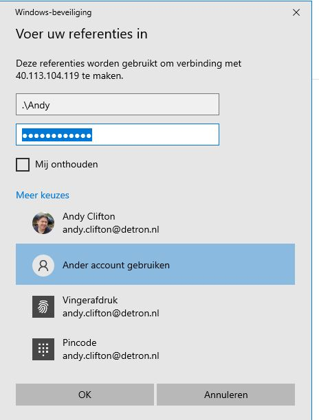

## Installeer Hyper-V en installeer WIndows 2019 op een Hyper-V machine.

Als je bent ingelogd op de machine gaan we beginnen met de installatie van de Hyper-V Features.
Open Server Manager en klik op **Manage** en daarna op **Add Roles and Features**

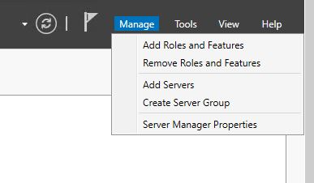

In het before you begin scherm klik je op **Next**

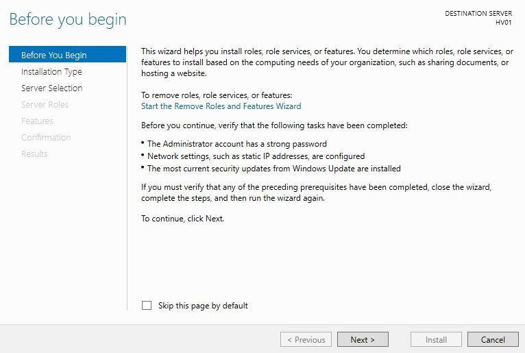

Selecteer **Role-Based or Feature-Based Installation**

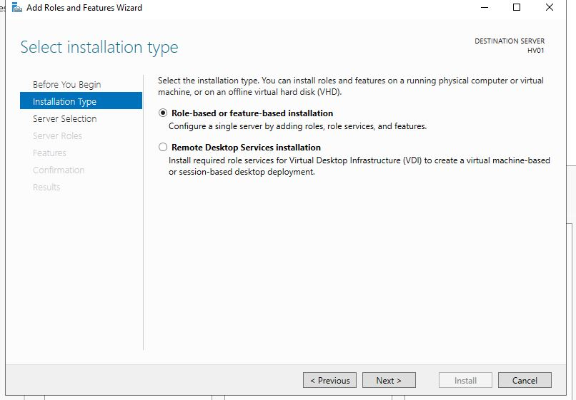

Je kunt nu kiezen op welke server je de installatie wilt gaan doen.We willen dit installeren op de nieuw gebouwde server.
Dus kunnen we klikken op **Next**

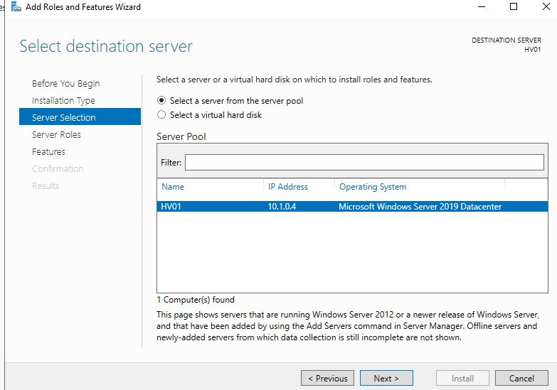

Nu komen we op het scherm om de role te installeren. Klik op **Hyper-V**

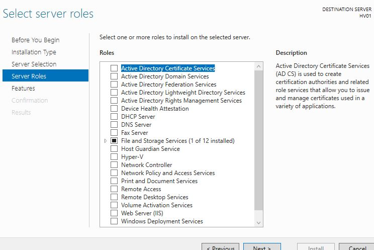

Daarna komt er een pop-up naar boven waarbij ook de features worden weergegeven die noodzakelijk zijn om Hyper-V te kunnen gebruiken.
Klik dan ook op **Add Features**

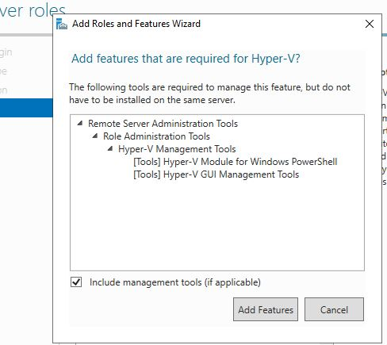

Nu is Hyper-V geselecteerd en kunnen we verder. Klik op **Next**

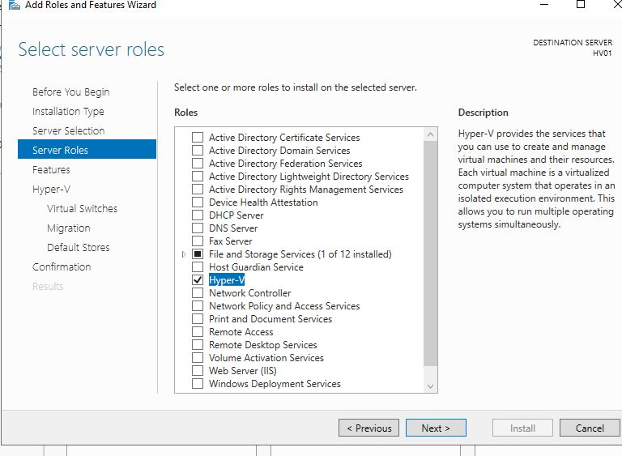

Klik bij Features ook weer op **Next**
We gaan nu door naar de configuratie van Hyper-V

Je komt nu uit in het beginscherm van Hyper-V configuratie en klik op **Next**

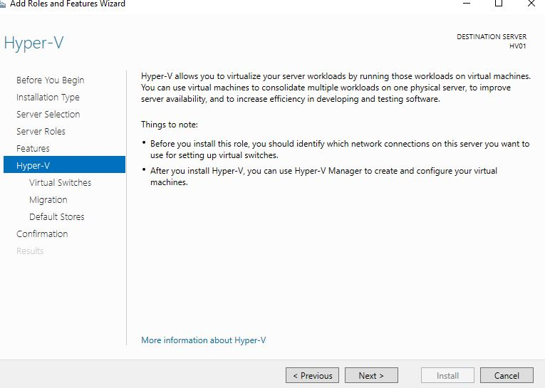

Vervolgens selecteer je een Netwerkkaart die je speciaal geselecteerd hebt voor Hyper-V en klik op **Next**

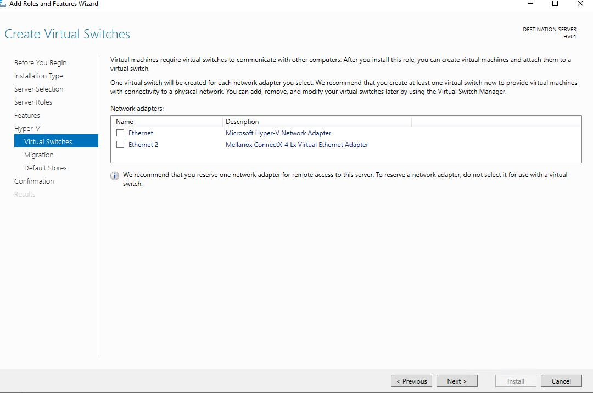

## Azure Site Recovery via Powershell

Mocht je nu veel machines hebben die toegevoegd moeten worden dan zou het makkelijk kunnen zijn om dit via Powershell uit te voeren.
Hieronder een link van Microsoft learn waarbij je via Powershell ASR kunt enable en replicaties kunt starten.

~~~
https://learn.microsoft.com/en-us/azure/site-recovery/azure-to-azure-powershell
~~~
