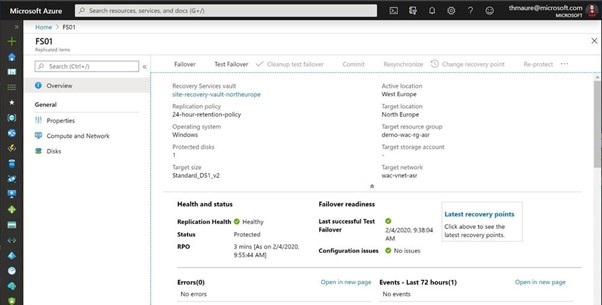
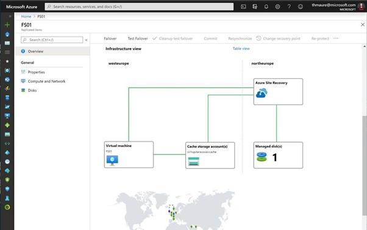

# Configure Azure ARC in een test omgeving

### ==> Disclaimer work in progress. <==

## Voorwoord

Soms is het handig om even snel een test omgeving op te zetten, Zodat je dingen kunt testen. Echter is het niet altijd mogelijk om een hele Hyper-V omgeving op te tuigen.
Hoe ga je dat snel doen? Wat heb je daar voor nodig? en kan dit in Azure? Meerdere vragen die ik nog wel eens gesteld krijg.
Dus in deze blog ga ik jullie uitleggen hoe je in Azure een Hyper-V omgeving kunt bouwen, en hoe je daarna Azure ARC erop installeert zodat je de machines kunt beheren via de Azure Portal.

## Bouw een nieuwe Server die geschikt is voor Hyper-V (by Portal and Powershell)

We gaan nu via de portal een nieuwe machine bouwen die voldoet aan de eisen om Hyper-V te mogen installeren.(heel veel machines in Azure hebben namelijk niet de juiste specs om een Hyper-V omgeving te kunnen optuigen.)

Ga naar http://portal.azure.com en log in met de credentials om een machine te kunnen bouwen.
Ga naar meer Resources.

## Failover Azure VM naar een andere regio.

Nadat we de Disaster recovery hebben ingesteld en de replicatie heeft gelopen kunnen we nu wat grafische bronnen bekijken die duidelijk aangeven wat er gebeurt en hoe de resources met elkaar verbonden zijn.

Je kunt een failover uitvoeren waarmee je een productie failover uitvoert van de vm. Als de regio waar de source op staat nog beschikbaar is kun je ASR de machine laten stoppen en de laatste wijzigingen laten syncen, zodoende hebben we geen gegevens verlies.
Dit is uiteraard alleen mogelijk als de source regio nog bestaat. Anders neemt ASR de laatst bestaande restore point.

Voorbereid zijn op disaster recovery is uitstekend. We willen er echter zeker van zijn dat het werkt als je het nodig hebt. Je wilt niet wachten tot een echte ramp toeslaat om erachter te komen of alles correct is ingesteld. Dit is waar Testfailover voor is. Testfailover is een mogelijkheid voor ons om failover van de virtuele machine naar een geïsoleerd virtueel netwerk in de doelregio te maken om de virtuele machine en toepassing te kunnen testen zonder enige impact op de productie-implementatie.‎

‎Als je meerdere vm's hebt die je in een specifieke volgorde wilt failoveren en misschien zelfs enkele extra scripts wilt laten uitvoeren om volledig failover uit een regio uit te voeren, biedt ASR ons ook [Recoveryplans](https://docs.microsoft.com/en-us/azure/site-recovery/recovery-plan-overview?WT.mc_id=itopstalk-blog-thmaure). Recoveryplans zijn idealer voor complexere scenario's dan slechts één virtuele machine.‎

## Azure Site Recovery via Powershell

Mocht je nu veel machines hebben die toegevoegd moeten worden dan zou het makkelijk kunnen zijn om dit via Powershell uit te voeren.
Hieronder een link van Microsoft learn waarbij je via Powershell ASR kunt enable en replicaties kunt starten.

~~~
https://learn.microsoft.com/en-us/azure/site-recovery/azure-to-azure-powershell
~~~
