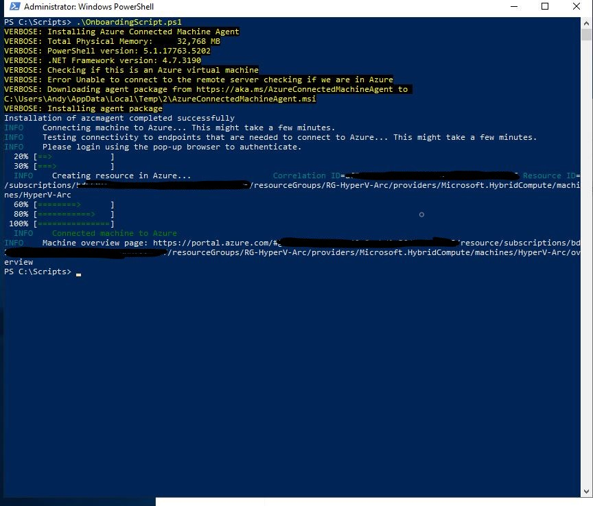

# Configure Azure ARC in een test omgeving

### ==> Disclaimer work in progress. <==

## Voorwoord

Soms is het handig om even snel een testomgeving op te zetten, zodat je dingen kunt testen. Echter is het niet altijd mogelijk om een hele Hyper-V omgeving op te tuigen.
Hoe ga je dat snel doen? Wat heb je daar voor nodig? En kan dit in Azure? Meerdere vragen die ik nog wel eens gesteld krijg.
In deze blog ga ik jullie uitleggen hoe je in Azure een Hyper-V omgeving kunt bouwen en hoe je daarna Azure ARC erop installeert zodat je de machines kunt beheren via de Azure Portal.

<ins>Wat is Azure Arc?:</ins>

Met Azure Arc kun je Windows- en Linux-machines beheren die buiten Azure worden gehost in Azure. Dit betekent dat je Azure-services kunt gebruiken op fysieke servers of servers die worden uitgevoerd in services van andere cloudproviders.

Azure Arc is in september 2020 algemeen beschikbaar geworden.

## Bouw een nieuwe Server die geschikt is voor Hyper-V (Portal)

We gaan nu via de portal een nieuwe machine bouwen die voldoet aan de eisen om Hyper-V te mogen installeren. (heel veel machines in Azure hebben namelijk niet de juiste specs om een Hyper-V omgeving te kunnen optuigen.)

Ga naar http://portal.azure.com en log in met de credentials om een machine te kunnen bouwen.

Ga naar **Create a Resources.**

Zoek daarna op **Windows Server**, en klik daarna op **Create**

Kies daarna voor **Windows Server 2019 Datacenter** en druk op **Create**

-----
Vervolgens moet je de onderstaande gegevens invullen:

~~~
Subscription = "de subscription die je gebruikt om machines te installeren"
Resource Group = selecteer een bestaande Resource group of maak een nieuwe aan.
Virtual Machine name = HV01
Region = kies de regio die het dichtst bij je zit. In ons geval is dat West-Europe.
Availablility Options = No Infrastructure redundancy required (kies niet hiervoor als je een live omgeving ervan gaat maken)
Security Type = Trusted launch virtual machines
Image = Windows Server 2019 Datacenter - x64 Gen1 (let op dit Moet **GEN1** zijn anders werkt het niet)
Size = Dit moet een V3 versie zijn om Hyper-V te kunnen installeren. Dus de Stansdard_D8s_v3

Username = Zelf in te vullen
Password = Zelf in te vullen

De rest mag default blijven
~~~

Klik op **Review & Create** 

Na de review kun je op **Create** klikken

Na een tijdje is de machine klaar en gaan we connecten en inloggen op de machine.

Ga naar de resource die we net hebben aangemaakt en klik op **Connect**.

Mocht je een andere manier dan Native RDP hebben geconfigureerd connect dan via die manier Anders klik op **select** bij Native RDP en er wordt een rdp file gedownload.

Open de RDP file en login op de nieuwe Server met de Admin credentials die je daarstraks hebt opgegeven.

## Bouw een nieuwe Server die geschikt is voor Hyper-V (Powershell)

~~~~
# Variables
$resourceGroupName = "YourResourceGroupName"
$vmName = "YourVMName"
$location = "East US" # Change this to the desired Azure region
$adminUsername = "YourAdminUsername"
$adminPassword = "YourAdminPassword"
$vmSize = "Standard_D8s_v3" (nodig voor een Gen1 machine)
$imagePublisher = "MicrosoftWindowsServer"
$imageOffer = "WindowsServer"
$imageSku = "2019-Datacenter"
$nicName = "YourNICName"
$vnetName = "YourVNetName"
$subNetName = "YourSubnetName"

# Create a new resource group
New-AzResourceGroup -Name $resourceGroupName -Location $location

# Create a new virtual network
$subnet = New-AzVirtualNetworkSubnetConfig -Name $subNetName -AddressPrefix "10.0.1.0/24"
$vnet = New-AzVirtualNetwork -ResourceGroupName $resourceGroupName -Name $vnetName -Location $location -AddressPrefix "10.0.0.0/16" -Subnet $subnet

# Create a public IP address
$publicIp = New-AzPublicIpAddress -ResourceGroupName $resourceGroupName -Name "YourPublicIP" -AllocationMethod Dynamic -Location $location

# Create a network security group (optional)
$nsg = New-AzNetworkSecurityGroup -ResourceGroupName $resourceGroupName -Name "YourNSG" -Location $location

# Allow RDP traffic (optional)
$rdpRule = New-AzNetworkSecurityRuleConfig -Name "Allow-RDP" -Description "Allow RDP" -Access Allow -Protocol Tcp -Direction Inbound -Priority 100 -SourceAddressPrefix "*" -SourcePortRange "*" -DestinationAddressPrefix "*" -DestinationPortRange 3389
$nsg | Add-AzNetworkSecurityRuleConfig -NetworkSecurityRule $rdpRule
$nsg | Set-AzNetworkSecurityGroup

# Create a network interface
$nic = New-AzNetworkInterface -Name $nicName -ResourceGroupName $resourceGroupName -Location $location -SubnetId $vnet.Subnets[0].Id -PublicIpAddressId $publicIp.Id -NetworkSecurityGroupId $nsg.Id

# Create the virtual machine configuration
$vmConfig = New-AzVMConfig -VMName $vmName -VMSize $vmSize
$vmConfig = Set-AzVMOperatingSystem -VM $vmConfig -Windows -ComputerName $vmName -Credential (New-Object PSCredential -ArgumentList $adminUsername, (ConvertTo-SecureString -AsPlainText -Force $adminPassword))

$vmConfig = Set-AzVMSourceImage -VM $vmConfig -PublisherName $imagePublisher -Offer $imageOffer -Skus $imageSku -Version "latest"
$vmConfig = Add-AzVMNetworkInterface -VM $vmConfig -Id $nic.Id

# Create the VM
New-AzVM -ResourceGroupName $resourceGroupName -Location $location -VM $vmConfig

~~~~

Login op je machine.

## Installeer Hyper-V en installeer Windows 2019 op een Hyper-V machine.

Als je bent ingelogd op de machine gaan we beginnen met de installatie van de Hyper-V Features.
Open Server Manager en klik op **Manage** en daarna op **Add Roles and Features**

In het before you begin scherm klik je op **Next**

Selecteer **Role-Based or Feature-Based Installation**

Je kunt nu kiezen op welke server je de installatie wilt gaan doen. We willen dit installeren op de nieuw gebouwde server.
Dus kunnen we klikken op **Next**

Nu komen we op het scherm om de role te installeren. Klik op **Hyper-V**

Daarna komt er een pop-up naar boven waarbij ook de features worden weergegeven die noodzakelijk zijn om Hyper-V te kunnen gebruiken.
Klik dan ook op **Add Features**

Nu is Hyper-V geselecteerd en kunnen we verder. Klik op **Next**

Klik bij Features ook weer op **Next**
We gaan nu door naar de configuratie van Hyper-V

Je komt nu uit in het beginscherm van Hyper-V configuratie en klik op **Next**

Vervolgens selecteer je een netwerkkaart die je speciaal geselecteerd hebt voor Hyper-V en klik op **Next**

Hierna komen we in het tabblad migration. Mocht je meerdere Hyper-V nodes hebben dan kun je er voor kiezen om Live Migration aan te zetten.
Voor nu is dit slechts een test en hebben we dus ook maar 1 node. We zetten hier de Migration dan ook niet aan. Dus klik op **Next**

Vul de default locaties voor de VM's in en klik op **Next**

Nu is alles geconfigureerd en kunnen we op **Install** Klikken.

~~~~
Mocht je Hyper-V willen deployen via Powershell gebruik dan onderstaande regel:

Install-WindowsFeature -Name Hyper-V -IncludeManagementTools

~~~~

Bouw nu 2 Virtuele Windows Servers. Hiermee kunnen we laten zien hoe je AzureArc kunt configureren.

## Configureer je VM zodat je Azure Arc kunt installeren op een Azure VM.

Normaal gesproken installeer je natuurlijk geen Azure ARC op een Azure VM machine.
Daarom moeten we de machine een klein beetje tweaken om te kunnen gaan spelen met AzureArc.

Open hiervoor Powershell en voer de volgende gegevens in: 

~~~~
[System.Environment]::SetEnvironmentVariable("MSFT_ARC_TEST",'true', [System.EnvironmentVariableTarget]::Machine)

Set-Service WindowsAzureGuestAgent -StartupType Disabled -Verbose
Stop-Service WindowsAzureGuestAgent -Force -Verbose

~~~~

Mocht het nodig zijn dan kun je nog een Firewall rule aanmaken om toe te staan dat er connectie gemaakt wordt.
New-NetFirewallRule -Name BlockAzureIMDS -DisplayName "Block access to Azure IMDS" -Enabled True -Profile Any -Direction Outbound -Action Block -RemoteAddress 169.254.169.254

## Azure Arc Configureren

Je kunt Linux- en Windows-servers onboarden met behulp van het Azure Arc Center in de Azure Portal.

Wanneer je je in de Azure Portal bevindt Zoek op **Azure Arc**.

Klik dan op **Infrastructure** en daarna op **ADD** bij Servers.

Nu kun je kiezen voor Single, Multiple of Update management.

~~~~
Single = 1 machine per keer installeren
Multiple = meerdere machines installeren via een Service Principal, hiermee kun je het script geautomatiseerd laten lopen zonder tussenkomst op meerdere machines.
Update Management = Machines die in Azure Update Management staan worden door middel van een Service principal toegevoegd aan Azure ARC
~~~~

Aangezien we het gaan gebruiken voor een test zou ik kiezen voor single als je snel de 2 machines wilt toevoegen, of mltiple als je al een service principal hebt.

We kiezen nu dus voor **Generate Script** bij Add a single server

Bij Prerequisites bekijk deze en klik daarna op **Next**

Nu gaan we de Resource details invullen

~~~~
Subscription = de bestaande Subscription
Resource group = een resource group die je gemaakt hebt voor Azure ARC

Region = Regio het dichtst in de buurt is van je locatie. 
Operating System = Linux of Windows

Connectivity method = Public or Private endpoint afhankelijk wat je geselecteerd hebt.
~~~~
Klik daarna op **Next**

Daarna kun je Tags aangeven voor de Servers mocht dat nodig zijn. Bijvoorbeeld voor Backup of responsible groups, locatie, enz.
Klik daarna op **Next**

Daarna krijg je het script te zien. Je kunt deze kopiëren of je kunt de ps1 downloaden. Download de PS1 en kopieer die naar de Hyper-V server.

Login op de Hyper-V server en open Powershell in Admin mode.

In de folder C:\Scripts heb ik de ps1 geplaatst. Deze mag je nu runnen. 
Aan het einde komt er een pop-up naar voren om je Azure credentials in te vullen. Zorg dat je Enhanced mode voor IE uit hebt staan.

Vul hier je emailadres in voor Azure. en klik op **Next**

Vul je wachtwoord in en klik op **Next**

Hierna geeft powershell aan dat het script succesvol is afgerond

Als je daarna in Azure naar Azure Arc gaat en naar Servers dan zul je deze machine hier zien staan

Hiermee is de installatie van Azure Arc afgerond en kun je de machines die je hebt gebruiken om Azure Policy's, Update management, Logic Apps of andere dingen erop los te laten.
Later maak ik nog een blog over hoe je Update manager gebruikt op je Azure Arc machines.

