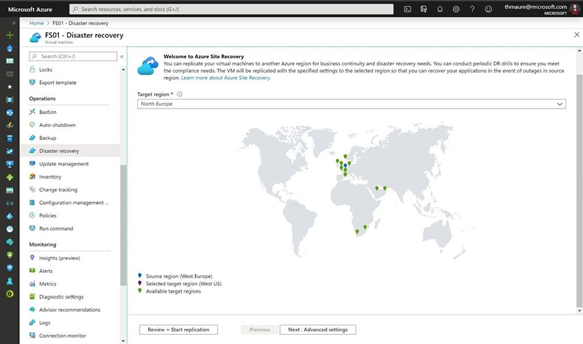
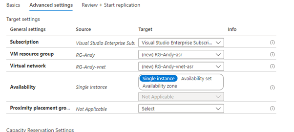
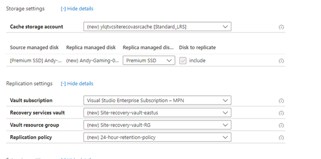

# Disaster Recovery

### ==> Disclaimer work in progress. <==

## Voorwoord

Als je een virtuele machine hebt draaien in Azure en je wilt er voor zorgen dat je machines zoveel mogelijk beschermd zijn tegen downtime, dan zijn er meerdere dingen die je wilt bekijken in de termen van availability.
Je moet zorgen dat je over de benodigde uptime beschikt in de regio waar de vm’s worden uitgevoerd.
Hiervoor kun je denken aan verschillende storage opties zoals Premium Storage die voor 1 disk een SLA biedt van 99,9%. Verder kun je werken met Availability Sets en Availability zones, hiermee verdeel je een belangrijke server over meerdere datacenters of meerdere zones in 1 regio.
Echter willen we ook de server beschermen tegen het uitvallen van een regio. Hiervoor is Azure Site Recovery (ASR) een geschikte oplossing. Hiermee repliceren we de machine asynchroon naar de andere regio of regio’s.

Laten we nu de setup van ASR er eens bijpakken.

## Setup Disaster Recovery voor Azure Vm’s

Het instellen van een Azure Site Recovery voor een vm kan redelijk eenvoudig zijn. In ons geval hebben we een virtuele machine die uitgevoerd wordt in de regio West-Europe. Voordat we de Disaster Recovery kunnen configureren moet je er voor zorgen dat je de omgeving op de juiste manier geconfigureerd en ontworpen hebt.
Mocht je willen weten welke vereisten er zijn rondom je architectuur, bekijk dan de onderstaande links.

-[Support Matrix for Azure VM disaster recovery between Azure Regions](https://docs.microsoft.com/en-us/azure/site-recovery/azure-to-azure-support-matrix?WT.mc_id=itopstalk-blog-thmaure)

-[Azure to Azure disaster recovery architecture](https://docs.microsoft.com/en-us/azure/site-recovery/azure-to-azure-architecture?WT.mc_id=itopstalk-blog-thmaure)

Er zijn 3 manieren om disaster recovery for Azure vm’s te configuren

~~~
- Azure Powershell/AzureCLI
- Azure Recovery Service vault
- replicatie direct starten vanuit de vm

~~~

de replicatie direct starten vanuit de vm is de meest gebruikte manier en die zal ik hier dan ook nog verder bespreken.

**Ga naar** de vm via de Azure Portal
**Open Disaster Recovery** onder Operations

Hier is het makkelijk en hoeven we alleen maar de Target Regio in te vullen. In deze [lijst](https://docs.microsoft.com/en-us/azure/availability-zones/cross-region-replication-azure) zie je wat de Cross regio’s zijn. Hier is het makkelijker en more common sense om deze te kiezen als Target Region.

Hierna moeten we een aantal Advanced settings configureren. ASR geeft zelf al een paar suggesties, maar je kunt dit aanpassen naar wat jullie denken dat correct is.

Verder kun je ook de Storage en Replication Settings aanpassen.
Hierbij kun je bij Storage bijvoorbeeld kiezen om niet een Premium SSD maar slechts een HDD disk of een Standard SSD disk te gebruiken, dit om kosten te besparen.
Verder kun je bij Replication settings de Replication Policy aanpassen en daarmee de sync laten lopen.

Als je alles aangepast hebt naar hoe je dit zelf zou willen dan kun je op Review+Start Replication klikken. Dit zal een aantal uren duren voor dit is aangemaakt en de replicatie heeft gelopen. (Dit is afhankelijk van de grootte van de vm).

## Failover Azure VM naar een andere regio.

Nadat we de Disaster recovery hebben ingesteld en de replicatie heeft gelopen kunnen we nu wat grafische bronnen bekijken die duidelijk aangeven wat er gebeurt en hoe de resources met elkaar verbonden zijn.

Je kunt een failover uitvoeren waarmee je een productie failover uitvoert van de vm. Als de regio waar de source op staat nog beschikbaar is kun je ASR de machine laten stoppen en de laatste wijzigingen laten syncen, zodoende hebben we geen gegevens verlies.
Dit is uiteraard alleen mogelijk als de source regio nog bestaat. Anders neemt ASR de laatst bestaande restore point.

Voorbereid zijn op disaster recovery is uitstekend. We willen er echter zeker van zijn dat het werkt als je het nodig hebt. Je wilt niet wachten tot een echte ramp toeslaat om erachter te komen of alles correct is ingesteld. Dit is waar Testfailover voor is. Testfailover is een mogelijkheid voor ons om failover van de virtuele machine naar een geïsoleerd virtueel netwerk in de doelregio te maken om de virtuele machine en toepassing te kunnen testen zonder enige impact op de productie-implementatie.‎

‎Als je meerdere vm's hebt die je in een specifieke volgorde wilt failoveren en misschien zelfs enkele extra scripts wilt laten uitvoeren om volledig failover uit een regio uit te voeren, biedt ASR ons ook [Recoveryplans](https://docs.microsoft.com/en-us/azure/site-recovery/recovery-plan-overview?WT.mc_id=itopstalk-blog-thmaure). Recoveryplans zijn idealer voor complexere scenario's dan slechts één virtuele machine.‎

## Azure Site Recovery via Powershell

Mocht je nu veel machines hebben die toegevoegd moeten worden dan zou het makkelijk kunnen zijn om dit via Powershell uit te voeren.
Hieronder een link van Microsoft learn waarbij je via Powershell ASR kunt enable en replicaties kunt starten.

~~~
https://learn.microsoft.com/en-us/azure/site-recovery/azure-to-azure-powershell
~~~
