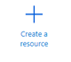
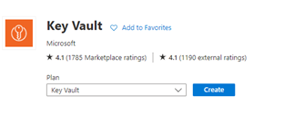
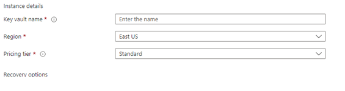

# Disk Encryptie in Azure VMs

## Voorwoord
In het verleden vereiste het proces van het encrypten van een virtuele machine in Microsoft Azure een AD App account om het werk uit te kunnen voeren.
Tegenwoordig hebben we een eenvoudigere manier om onze VM’s in Microsoft Azure te encrypten en deze nieuwe methode is geïntegreerd in de Azure Portal.
In dit artikel gaan we de basisprincipes behandelen om encryptie in te schakelen met behulp van de nieuwe methode, inclusief het maken van een Azure Key Vault.
We nemen ook de stappen door die kunnen worden uitgevoerd in de Azure Portal en de Powershell functies om het encryptieproces te ondersteunen.

## Inrichten van de Key Vault
De eerste stap is het creëren van een Key Vault.
Log in op de Azure portal en klik op **Create a resource**.

Vul in **Key vault** en klik op **Create**.

Een nieuwe wizard zal naar voren komen. En hier kunnen we alle basisinstellingen configureren die we nodig hebben om de nieuwe Key Vault met nieuwe schijf encryption te gaan gebruiken.

Vul in: 
1. naam, 
2. region
3. resource

Klik op **Next** en we gaan naar Access Policy. 
Zorg ervoor dat het vinkje staat bij **Azure Disk encryption for volume encryption**. 

