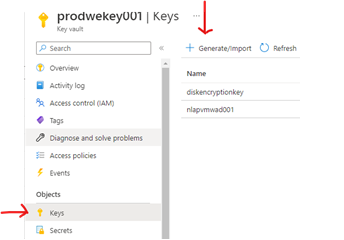
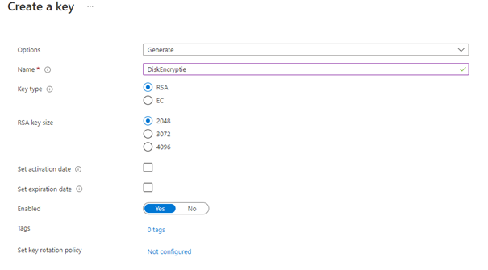
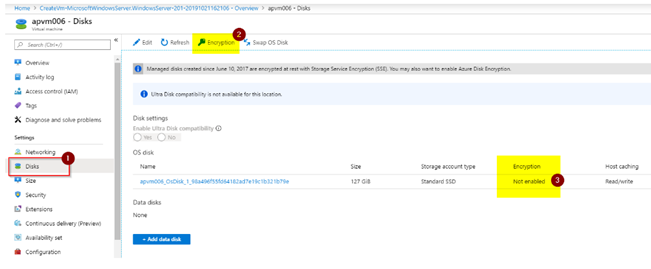

# Disk Encryptie in Azure VMs

### ==> Disclaimer work in progress <==

## Voorwoord
In het verleden vereiste het proces van het encrypten van een virtuele machine in Microsoft Azure een AD App account om het werk uit te kunnen voeren.
Tegenwoordig hebben we een eenvoudigere manier om onze VM’s in Microsoft Azure te encrypten en deze nieuwe methode is geïntegreerd in de Azure Portal.
In dit artikel gaan we de basisprincipes behandelen om encryptie in te schakelen met behulp van de nieuwe methode, inclusief het maken van een Azure Key Vault.
We nemen ook de stappen door die kunnen worden uitgevoerd in de Azure Portal en de Powershell functies om het encryptieproces te ondersteunen.


## Inrichten van de Key Vault
De eerste stap is het creëren van een Key Vault.
Log in op de Azure portal en klik op **Create a resource**.


Vul in **Key vault** en klik op **Create**.


Een nieuwe wizard zal naar voren komen. En hier kunnen we alle basisinstellingen configureren die we nodig hebben om de nieuwe Key Vault met nieuwe schijf encryption te gaan gebruiken.

Vul in: 
~~~
Key vault name = Naam 
Region = Regio
Pricing Tier = Standard of Premium
~~~


Klik op **Next** en we gaan naar Access Policy. 
Zorg ervoor dat het vinkje staat bij **Azure Disk encryption for volume encryption**. 


Klik op **review+ create** om de inrichting van de KeyVault te starten.


> **_Notitie:_** Als je een hub- en spoke- topologie gebruikt, is het gebruik van een Key Vault op je shared infrastructure bij de hub de juiste manier.
Op deze manier maken al je encrypted VM’s gebruik van de centralized keys om hun schijven op te slaan en te encrypten.

Na het maken van de Key Vault is onze volgende stap het maken van onze eerste set van Keys. Open de net aangemaakte Key Vault en klik onder objects op **Keys**.

Klik op **Generate/Import**.



Op de Create a Key pagina selecteer het volgende:
~~~
Options = Generate
Name = Vul een logische naamgeving in
Key type = RSA
RSA key size = minimum 2048
Enabled = Yes
~~~



## Encrypt een VM via de Azure Portal.


Tegenwoordig biedt de Azure Portal een eenvoudige manier om uw VM te encrypten met integratie van Azure Key Vault.
Klik in de VM waar we de schijf willen encrypten op Disks (nummer 1) en een lijst met alle schijven die aan de gegeven VM gekoppeld zijn, wordt weergegeven.
Bij nummer 3 kunnen we de huidige status van de encryption  voor een bepaalde schijf zien.
Om het coderingsproces te starten klikken we op Encryption (nummer 2)




## Schijven en encryptie scenario’s beheren.

## Disk Encryptie gebruiken met PowerShell

Met al die informatie zou de PowerShell cmdlet (**Set-AzVMDiskEncryptionExentsion** ) vergelijkbaar zijn met de onderstaande cmdlet.

```
Set-AzVmDiskEncryptionExtension -ResourceGroupName <ResourceGroupName> -VMName <VMName> -DiskEncryptionKeyVaultId  <Key Vault Resource ID> -DiskEncryptionKeyVaultUrl <Key Vault URL> -KeyEncryptionKeyVaultId <Key Vault Resource ID> -KeyEncryptionKeyUrl <Key URL> -VolumeType "All"
```


Meer informatie over schijf encryptie vind je [hier](https://learn.microsoft.com/en-us/azure/virtual-machines/windows/disk-encryption-faq#can-i-encrypt-both-boot-and-data-volumes-with-azure-disk-encryption)


