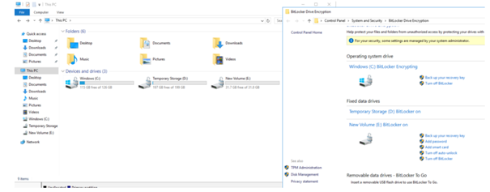

# Disk Encryptie in Azure VMs

### ==> Disclaimer work in progress <==

## Voorwoord
In het verleden vereiste het proces van het encrypten van een virtuele machine in Microsoft Azure een AD App account om het werk uit te kunnen voeren.
Tegenwoordig hebben we een eenvoudigere manier om onze VM’s in Microsoft Azure te encrypten en deze nieuwe methode is geïntegreerd in de Azure Portal.
In dit artikel gaan we de basisprincipes behandelen om encryptie in te schakelen met behulp van de nieuwe methode, inclusief het maken van een Azure Key Vault.
We nemen ook de stappen door die kunnen worden uitgevoerd in de Azure Portal en de Powershell functies om het encryptieproces te ondersteunen.


## Inrichten van de Key Vault
De eerste stap is het creëren van een Key Vault.
Log in op de Azure portal en klik op **Create a resource**.


Vul in **Key vault** en klik op **Create**.


Een nieuwe wizard zal naar voren komen. En hier kunnen we alle basisinstellingen configureren die we nodig hebben om de nieuwe Key Vault met nieuwe schijf encryption te gaan gebruiken.

Vul in: 
~~~
Key vault name = Naam 
Region = Regio
Pricing Tier = Standard of Premium
~~~


Klik op **Next** en we gaan naar Access Policy. 
Zorg ervoor dat het vinkje staat bij **Azure Disk encryption for volume encryption**. 


Klik op **review+ create** om de inrichting van de KeyVault te starten.


> **_Notitie:_** Als je een hub- en spoke- topologie gebruikt, is het gebruik van een Key Vault op je shared infrastructure bij de hub de juiste manier.
Op deze manier maken al je encrypted VM’s gebruik van de centralized keys om hun schijven op te slaan en te encrypten.

Na het maken van de Key Vault is onze volgende stap het maken van onze eerste set van Keys. Open de net aangemaakte Key Vault en klik onder objects op **Keys**.

Klik op **Generate/Import**.


Op de Create a Key pagina selecteer het volgende:
~~~
Options = Generate
Name = Vul een logische naamgeving in
Key type = RSA
RSA key size = minimum 2048
Enabled = Yes
~~~


## Encrypt een VM via de Azure Portal.


Tegenwoordig biedt de Azure Portal een eenvoudige manier om uw VM te encrypten met integratie van Azure Key Vault.
Klik in de VM waar we de schijf willen encrypten op Disks (nummer 1) en een lijst met alle schijven die aan de gegeven VM gekoppeld zijn, wordt weergegeven.
Bij nummer 3 kunnen we de huidige status van de encryption  voor een bepaalde schijf zien.
Om het coderingsproces te starten klikken we op Encryption (nummer 2)


In het nieuwe tabblad hebben we drie opties: Geen (no encryption), OS disk (alleen de schijf met het operating system), of OS and data disk (alle schijven op deze VM).

Op de Encryption settings pagina selecteer het volgende:

~~~~
Disk to Encrypt = OS Disk
Key Vault =  de aangemaakte Key Vault
Key =  Selecteer de Key.
Version = Versie 
~~~~


Selecteer de Key die we zojuist hebben aangemaakt en klik daarna op Save.

Zodra je op opslaan klikt, wordt een dialoogvenster weergegeven waarin om een bevestiging gevraagd wordt, Klik op Ja.
Dit proces zorgt ervoor dat de VM opnieuw wordt opgestart, zorg ervoor dat je dit doet tijdens gepland onderhoud of als de gebruikers hiervan op de hoogte zijn.

Als onderdeel van de restart, zal de AzureDiskEncryption als extensie toegevoegd worden aan de VM.


## Schijven en encryptie scenario’s beheren.

Life is good, de schijf van het besturingssysteem wordt geëncrypt.
Een ding is echter zeker, er zullen nu veranderingen plaatsvinden!
Laten we een aantal mogelijke scenario’s uitvoeren bij het beheren van schijf encryption om te zien hoe je moet handelen wanneer deze acties zich voordoen.

Laten we beginnen met een vereiste om een nieuwe data schijf toe te voegen aan dezelfde VM waaraan we tijdens dit artikel ook gewerkt hebben.
Het belangrijkste (voordat u nadenkt over encryption) is om te begrijpen dat de schijf aanwezig moet zijn, en in het besturingssysteem geconnect moet zijn om de encryption te laten werken.
Als je de schijf toevoegt via de Azure Portal, wordt de schijf op de VM weergegeven als niet-geïnitialiseerd  en wordt deze niet gecodeerd.
Zorg ervoor dat u een letter op de schijf initialiseert, formatteert en toewijst.

Nadat u de nieuwe schijf aan het besturingssysteem hebt gepresenteerd,
gaat u terug naar de knop encryption en wijzigt u de gegevens in besturingssysteem en gegevensschijven en drukt u op opslaan.

Op dit moment is een herstart niet nodig en na de voltooiing worden de nieuwe schijven encrypt.


We kunnen de encryption in actie zien in de onderstaande afbeelding.
We hebben zojuist een nieuw volume toegevoegd (Letter D:). Na het uitvoeren van de bovenstaande procedure is de nieuwe schijf geëncrypt als onderdeel van het proces.


Wanneer je nieuwe schijven toevoegt aan de VM, moeten we het proces herhalen om de nieuwe schijven ook te versleutelen. (Houd hier rekening mee).


## Disk Encryptie gebruiken met PowerShell

Met al die informatie zou de PowerShell cmdlet (**Set-AzVMDiskEncryptionExentsion** ) vergelijkbaar zijn met de onderstaande cmdlet.

```
Set-AzVmDiskEncryptionExtension -ResourceGroupName <ResourceGroupName> -VMName <VMName> -DiskEncryptionKeyVaultId  <Key Vault Resource ID> -DiskEncryptionKeyVaultUrl <Key Vault URL> -KeyEncryptionKeyVaultId <Key Vault Resource ID> -KeyEncryptionKeyUrl <Key URL> -VolumeType "All"
```
Ik moet toegeven dat het verzamelen van alle informatie zeker geen makkelijke job is, omdat je die informatie moet ophalen met behulp van 2 cmdlets en de stukjes bij elkaar moet zetten om de bovenstaande cmdlet te maken.
Ik heb hiervoor een functie gevonden om het proces verder te automatiseren, je moet hiervoor de Key Vault naam, Key naam en de VM naam opgeven.
De functie verzamelt alle vereiste informatie in variabelen en start de encryptie van alle schijven op de aangeleverde VM.
Hier is de code voor de functie en om deze in een Powershell-sessie te gebruiken,vul in EncryptVM -Keyvaultname,KeyName,VMname


````
Function EncryptVM($KeyVault,$KeyName,$VM){
$kv = Get-azKeyVault -VaultName $KeyVault
$key = get-Azkeyvaultkey -Name $KeyName -VaultName $KeyVault
Set-AzVmDiskEncryptionExtension -ResourceGroupName $kv.ResourceGroupName `
-DiskEncryptionKeyVaultId  $kv.ResourceID `
-DiskEncryptionKeyVaultUrl $kv.VaultURI `
-VMName $VM -KeyEncryptionKeyVaultId $kv.ResourceID `-KeyEncryptionKeyUrl $key.id -SkipVmBackup -VolumeType "All"}

````

Meer informatie over schijf encryptie vind je [hier](https://learn.microsoft.com/en-us/azure/virtual-machines/windows/disk-encryption-faq#can-i-encrypt-both-boot-and-data-volumes-with-azure-disk-encryption)


