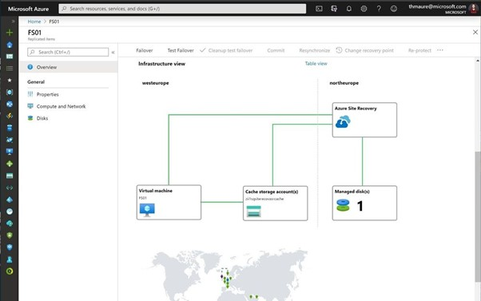

# Disaster Recovery

### ==> Disclaimer work in progress. <==

## Voorwoord

Als u uw on-premises omgeving wilt automatiseren, is Azure Arc Server een geweldige aanbieding voor het onboarden van Azure-beheerservices zoals Azure Monitor,Sentinel maar ook Defender en IAM.
Een van de andere voordelen die we nog hebben is het gebruik van Hybrid Workers. Hierdoor kun je RUnbooks,Logic Apps of Power Automate gebruiken om het beheer of deploy van dingen op je on-premise vm.

In deze blog laat ik je zien hoe je een Automation account maakt,Connect een server met Azure ARC,Creeren van een Hybrid Workers group en daarna het creeren en deployen van een Runbook op basis van Powershell.

## Maken van een Azure Automation Account.

Naar mijn idee kun je het Automation Account het beste in een eigen RG stoppen. Hierdoor hou je overzichtelijk wat hoort bij dit Automation account. Hou er netwerk technisch rekening mee dat dit account en alles wat er onder staat bij de omgevingen kan komen.

In dit document beschrijf ik niet hoe je een Resource group moet maken omdat ik er vanuit ga dat dit al bekend is.

Zoek in de zoekbalk naar Automation account en klik hierop.

Klik daarna op **Create**

Vul in: 
~~~

Resource Group = Aangemaakte Resource group
Automation Account name= Maak een logische naam aan voor dit account
Region = Zelfde als de RG

~~~

Klik **Next**

Nu kom je in het Advanced tabblad, hier kun je aangeven van welke identity dit account gebruik moet maken in dit geval kiezen wij voor een System Managed account.

De rest hoeven we voor nu niet aan te passen. Mocht je alleen private access toe willen staan (dus de toegang tot dit account ontsluiten van toegang ergens anders vandaan) dan moet je bij networking Private Access aanklikken.

Voor nu klik op **Review + Create**

Mocht je meer info willen over een Automation Account en hoe te creeren kijk dan hier

-[Create a standalone Azure Automation account](https://learn.microsoft.com/en-us/azure/automation/automation-create-standalone-account?WT.mc_id=modinfra-0000-thmaure&tabs=azureportal)

## Failover Azure VM naar een andere regio.

Nadat we de Disaster recovery hebben ingesteld en de replicatie heeft gelopen kunnen we nu wat grafische bronnen bekijken die duidelijk aangeven wat er gebeurt en hoe de resources met elkaar verbonden zijn.

Je kunt een failover uitvoeren waarmee je een productie failover uitvoert van de vm. Als de regio waar de source op staat nog beschikbaar is kun je ASR de machine laten stoppen en de laatste wijzigingen laten syncen, zodoende hebben we geen gegevens verlies.
Dit is uiteraard alleen mogelijk als de source regio nog bestaat. Anders neemt ASR de laatst bestaande restore point.

Voorbereid zijn op disaster recovery is uitstekend. We willen er echter zeker van zijn dat het werkt als je het nodig hebt. Je wilt niet wachten tot een echte ramp toeslaat om erachter te komen of alles correct is ingesteld. Dit is waar Testfailover voor is. Testfailover is een mogelijkheid voor ons om failover van de virtuele machine naar een geïsoleerd virtueel netwerk in de doelregio te maken om de virtuele machine en toepassing te kunnen testen zonder enige impact op de productie-implementatie.‎

‎Als je meerdere vm's hebt die je in een specifieke volgorde wilt failoveren en misschien zelfs enkele extra scripts wilt laten uitvoeren om volledig failover uit een regio uit te voeren, biedt ASR ons ook [Recoveryplans](https://docs.microsoft.com/en-us/azure/site-recovery/recovery-plan-overview?WT.mc_id=itopstalk-blog-thmaure). Recoveryplans zijn idealer voor complexere scenario's dan slechts één virtuele machine.‎

## Azure Site Recovery via Powershell

Mocht je nu veel machines hebben die toegevoegd moeten worden dan zou het makkelijk kunnen zijn om dit via Powershell uit te voeren.
Hieronder een link van Microsoft learn waarbij je via Powershell ASR kunt enable en replicaties kunt starten.

~~~
https://learn.microsoft.com/en-us/azure/site-recovery/azure-to-azure-powershell
~~~
