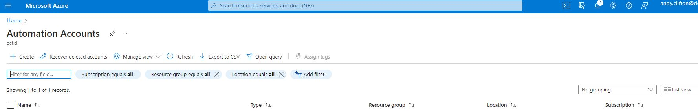

# Disaster Recovery

### ==> Disclaimer work in progress. <==

## Voorwoord

Als u uw on-premises omgeving wilt automatiseren, is Azure Arc Server een geweldige aanbieding voor het onboarden van Azure-beheerservices zoals Azure Monitor,Sentinel maar ook Defender en IAM.
Een van de andere voordelen die we nog hebben is het gebruik van Hybrid Workers. Hierdoor kun je RUnbooks,Logic Apps of Power Automate gebruiken om het beheer of deploy van dingen op je on-premise vm.

In deze blog laat ik je zien hoe je een Automation account maakt,Connect een server met Azure ARC,Creeren van een Hybrid Workers group en daarna het creeren en deployen van een Runbook op basis van Powershell.

## Maken van een Azure Automation Account.

Naar mijn idee kun je het Automation Account het beste in een eigen RG stoppen. Hierdoor hou je overzichtelijk wat hoort bij dit Automation account. Hou er netwerk technisch rekening mee dat dit account en alles wat er onder staat bij de omgevingen kan komen.

In dit document beschrijf ik niet hoe je een Resource group moet maken omdat ik er vanuit ga dat dit al bekend is.

Zoek in de zoekbalk naar Automation account en klik hierop.

Klik daarna op **Create**

Vul in: 
~~~

Resource Group = Aangemaakte Resource group
Automation Account name= Maak een logische naam aan voor dit account
Region = Zelfde als de RG

~~~

Klik **Next**

Nu kom je in het Advanced tabblad, hier kun je aangeven van welke identity dit account gebruik moet maken in dit geval kiezen wij voor een System Managed account.

De rest hoeven we voor nu niet aan te passen. Mocht je alleen private access toe willen staan (dus de toegang tot dit account ontsluiten van toegang ergens anders vandaan) dan moet je bij networking Private Access aanklikken.

Voor nu klik op **Review + Create**

Mocht je meer info willen over een Automation Account en hoe te creeren kijk dan hier

-[Create a standalone Azure Automation account](https://learn.microsoft.com/en-us/azure/automation/automation-create-standalone-account?WT.mc_id=modinfra-0000-thmaure&tabs=azureportal)

## Connect Server in Azure via Azure Arc

Als je een server die on-premises of bij een andere cloudprovider staat, wilt verbinden met Azure via Azure Arc, ga je in de Azure Portal naar Azure Arc Center en selecteert je Azure Arc-servers. Hier kun je op de knop **Toevoegen** klikken en kun je de onboarding-wizard doorlopen.  Over een paar weken zal ik ook nog een blog online brengen hoe je AzureArc configureert voor je on-premise omgeving.

## Creeren van Hybrid Worker Group.

Nu kun je Hybrid Worker Group  maken en onderhouden voor het uitvoeren van taken die je on-premise ook wilt uitvoeren , wat veerkracht biedt om taken uit te voeren voor meerdere Hybrid Workers. Met op extensies based Hybrid Workers (preview) kunnen zowel Azure-machines als niet-Azure-machines (via Arc-server) worden beheerd via ARM-sjablonen en -beleid.

Als je een hybrid worker wilt maken (die Windows- en Linux-servers kan zijn) Open het Automation account en ga naar Hybrid Worker groups

Vul in: 
~~~

Name = Logische naam voor HWG
Use Hybrid Worker Credentials = Custom
Choose Hybrid Worker Credentials = Add Credentials

~~~

Gebruik een service account met de juiste rechten die op de machines het script mag uitvoeren.
Ga nu het naar het tabblad  Hybrid Workers en klik op **Add Machines**

Je krijgt nu je machines te zien..

Selecteer de machine waarop je Hybrid Worker wil configureren en klik op **Add**

Hierna kun je klikken op **Review + Create**

Hierna zal de Hybrid Extension automatisch op deze machine geinstalleerd worden.

Mocht je willen kun je hier ook altijd nog meer servers toevoegen maar wij houden het hier even bij 1.

-[Deploy an extension-based Hybrid Runbook Worker in Azure Automation](https://docs.microsoft.com/en-us/azure/automation/extension-based-hybrid-runbook-worker-install?tabs=windows)

## Creeren van een nieuwe Azure Automation Runbook.
Je kunt een nieuw Azure Automation runbook maken, waarin het script wordt gehost dat je gaat uitvoeren. 
Afhankelijk van de versie van runbookruntime die je kiest, moet je ervoor zorgen dat deze versie ook op de Hybrid Worker server staat (denk aan Python en Powershell 7.0)

Ga in je Automation account naar Runbooks en klik daar op **Create a Runbook**

Hierna moet je een aantal default gegevens invullen.

Vul in: 
~~~

Name = Logische naam voor het Runbook
Runbook Type = (kies uit Powershell,Python,Powershell Workflow,Graphical Powershell,Graphical Powershell Workflow) Wij kiezen hier voor Powershell
Runtime Version = (kies uit 7.2,7.1,5.1) Wij kiezen hier voor 5.1 omdat die by default al op servers staan.

~~~

In het scherm wat nu naar voren komt kun je je powershell script invoeren. Wij kiezen er nu hier even voor om een txt bestand te deployen op de desktop.

Vul in: 
~~~

"from azure" | out-file "C:\Users\*username*\Desktop\hybrid.txt"

~~~

hierna klik je eerst op **Save** en daarna op **Publish**

 

## Run en Schedule Powershell Script als Azure Automation Runbook via Hybrid Worker group op een Azure Arc machine.

Jekunt nu je PowerShell-scripts uitvoeren en schedule als Azure Automation-runbooks op de hybrid workergroups die zijn verbonden met Azure Arc. 
Wanneer je het runbook uitvoert, kun je  nu selecteren op welke hybrid worker group dit script moet worden uitgevoerd.

 

 Via Output kun je nu zien wat er gebeurd..

 

 Je kunt dit runbook nu ook Schedule. Dit is heel eenvoudig door te klikken op **Link to Schedule** en selecteer of creer de schedule met zijn parameters.
 
 
  
