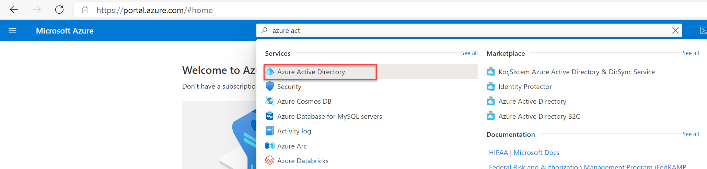

# Eenmalige toegangscode voor Azure AD B2B-Guest Users

### ==> Disclaimer work in progress <==

## Voorwoord
AzureAD B2B staat externe gebruikers toe om toepassingen,services en gegevens van de de Tenant te gebruiken.
Om gasten toegang toe te staan moeten ze een AzureAD account,Microsoft accont of een Google Federation hebben.(voor @gmail.com en @googlemail.com gebruikers).
Mocht een user nu geen vandeze accounts hebben dan kan er toch connectie gemaakt worden met een eenmalige toegangscode.
Deze code word naar het mail adres van de guest user gestuurd en de code blijft dan voor 30 minuten geldig.
Zodra de guest user zichzelf heeft geautentiseerd blijft de sessie 24 uur valid, daarna moet de user een nieuwe code aanvragen om opnieuw te kunnen inloggen.
gebruikers van eenmalige toegangscode moeten gebruik maken onderstaande links wanneer ze zich authenticeren.:

````
https://myapps.microsoft.com/?tenantid=<tenant id> 
https://portal.azure.com/<tenant id>
https://myapps.microsoft.com/<verified domain>.onmicrosoft.com
````
in bovenstaande moet uiteraard <tenant id> wel aangepast worden naar de Tenant id van je eigen omgeving.<verified domain> moet dan weer aangepast worden naar de domein naam van je tenant.
  
  
De mogelijkheid om Eenmalige toegangscode te gebruiken is er al sinds Oktober 2021, en kan gebruikt worden voor bestaande en nieuw te maken enants.
  


## Enable eenmalige toegangscode feature
  
De eerste stap is dat we de eenmalige toegangscode feature aanmoeten zetten voor guest users.

Log in op de Azure portal en ga naar **Azure Active Directory**.




