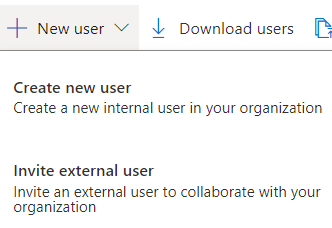

# Eenmalige toegangscode voor Azure AD B2B-Guest Users

### ==> Disclaimer work in progress <==

## Voorwoord
AzureAD B2B staat externe gebruikers toe om toepassingen, services en gegevens van de Tenant te gebruiken.
Om gasten toegang toe te staan moeten ze een AzureAD account, Microsoft account of een Google Federation hebben. (Voor @gmail.com en @googlemail.com gebruikers).
Mocht een user nu geen van deze accounts hebben dan kan er toch connectie gemaakt worden met een eenmalige toegangscode.
Deze code wordt naar het mailadres van de guest user gestuurd en de code blijft dan voor 30 minuten geldig.
Zodra de guest user zichzelf heeft geautentiseerd blijft de sessie 24 uur valid, daarna moet de user een nieuwe code aanvragen om opnieuw te kunnen inloggen.
Gebruikers van een eenmalige toegangscode moeten gebruik maken van onderstaande links wanneer ze zich authenticeren:

````
https://myapps.microsoft.com/?tenantid=<tenant id> 
https://portal.azure.com/<tenant id>
https://myapps.microsoft.com/<verified domain>.onmicrosoft.com
````
In bovenstaande moet uiteraard tenant id wel aangepast worden naar de Tenant id van je eigen omgeving. Verified domain moet dan weer aangepast worden naar de domeinnaam van je tenant.
  
  
De mogelijkheid om eenmalige toegangscodes te gebruiken is er al sinds oktober 2021 en kan gebruikt worden voor bestaande en nieuw te maken tenants.
  


## Enable eenmalige toegangscode feature
  
De eerste stap is dat we de eenmalige toegangscode feature aanmoeten zetten voor guest users.

Log in op de Azure portal en ga naar **Azure Active Directory**.


Ga nu naar **External Identities --> All Identity Providers**


  
In de configured identity providerslijst klik op **Email one time passcode** 
  


Druk op **Yes** bij Email one-time passcode for guests.
  

  
We hebben nu de feature geënabled, het is nu tijd om de eenmalige toegangscode te testen.

Ik ga nu een user uitnodigen en maak hem dan lid van de groep OCTID-Sales.
  
# Creëer een AzureAD B2B Guest User
  
 Ga naar Azure Active directrory -> Users en klik dan op **New User**
 
 Klik nu ook op **Invite external user**
  
    

Op de pagina van nieuwe user vul de volgende gegevens in:
  
~~~
  
Template =  Invite user
  
Identity:

Name = Volledige naam van de guest user
Email address = Mailadres van de guest user
First Name = Voornaam van de guest user
Last Name =  Achternaam van de guest user
  
~~~
  
 
  
**Klik** op Groups en **selecteer** dan de groep OCTID-Sales en daarna **klik** op Save
  
 
  
**Druk** op Invite 
  
 
  
De user krijgt een mail met een invite hiervoor.
  

  
De guest user krijgt nu een melding dat ze een code verstuurd krijgt.
  

  
In een paar seconden krijg je een mail die eruit ziet als onderstaande:


  
 
Deze code kun je invullen en dan log je in op de myapps van het bedrijf.
Dit is de manier waarop je eenmalige toegangscode voor B2B guest configureerd.  
